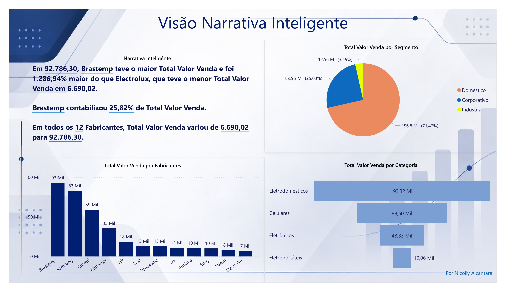
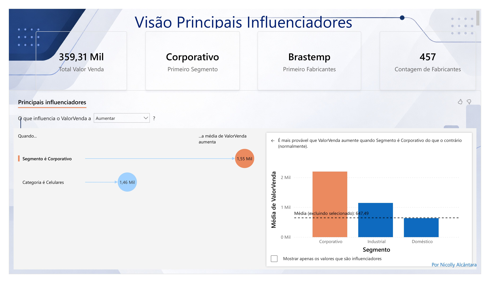
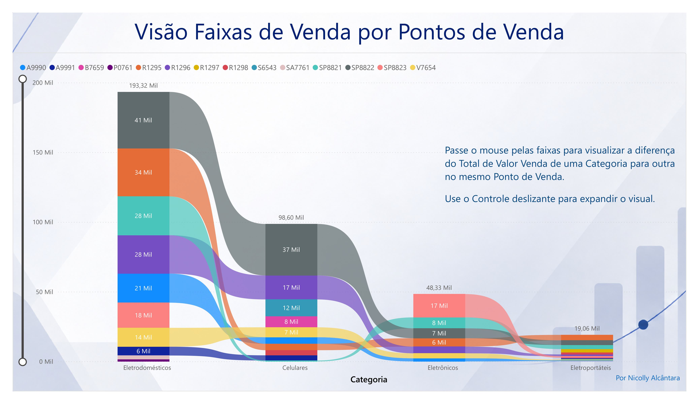
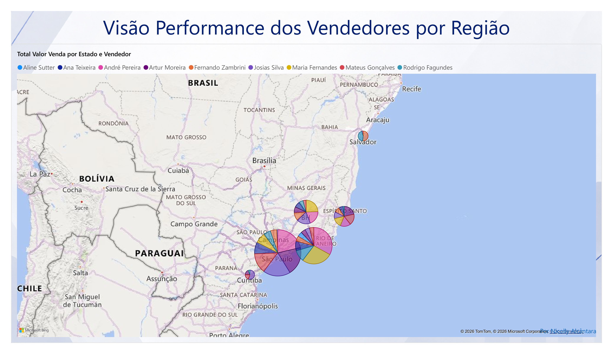

# Dashboard Comercial — Performance de Vendas

##  Sobre o projeto

Mini projeto desenvolvido no Power BI com foco na análise de performance de vendas, permitindo explorar os resultados por segmentos, categorias, fabricantes, pontos de venda, vendedores e regiões.

O projeto utiliza diferentes recursos de análise e visualização do Power BI para transformar os dados comerciais em informações que facilitam a interpretação do desempenho das vendas.

##  Ferramenta utilizada

- Power BI Desktop

##  Análises realizadas

###  Narrativa Inteligente

Análise do valor de venda considerando diferentes perspectivas comerciais:

- Segmentos;
- Categorias;
- Fabricantes;
- Valor total de vendas.

A análise apresenta comparações entre os fabricantes e destaca os principais resultados encontrados nos dados.

###  Principais Influenciadores

Utilização do recurso **Principais Influenciadores** do Power BI para identificar fatores relacionados ao aumento do valor de venda.

A análise considera características como:

- Segmento;
- Categoria;
- Fabricantes;
- Média do valor de venda.

###  Faixas de Venda por Pontos de Venda

Análise da distribuição do valor de venda entre diferentes categorias e pontos de venda.

O visual permite comparar o valor das vendas de uma categoria para outra dentro do mesmo ponto de venda.

###  Performance dos Vendedores por Região

Análise da distribuição do valor de venda por estado e vendedor, utilizando visualização geográfica para explorar a performance comercial por região.

##  Dashboards

### Visão Narrativa Inteligente

### Principais Influenciadores

### Faixas de Venda por Pontos de Venda

### Performance dos Vendedores por Região

##  Arquivos do projeto

- [Arquivo Power BI (.pbix)](./projeto-comercial.pbix)
- [Relatório completo em PDF](./mini-projeto-comercial.pdf)

##  Objetivo

Demonstrar a aplicação do Power BI na análise de dados comerciais, utilizando diferentes recursos de visualização e análise para explorar indicadores de vendas e identificar padrões de desempenho.

##  Autora

**Nicolly Alcântara**

Tecnóloga em Análise e Desenvolvimento de Sistemas | Power BI | Excel | SQL | Análise de Dados
